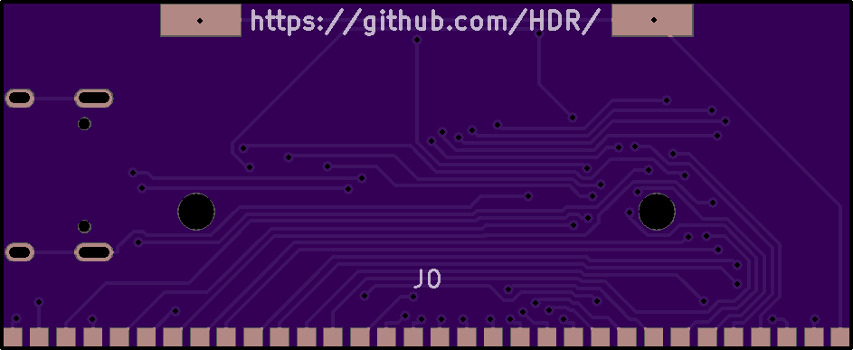

# The worlds smallest Game Boy cart flasher!
A clone of [J.Rodrigo's flasher](https://www.tindie.com/products/JRodrigo/cart-flasher-for-gameboy/)

[Purchase on OSHPARK](https://oshpark.com/shared_projects/0C5yyQZD)

**Flashing the bootloader**

Flashing is done over isp, i use a Raspberry pi for this, see https://github.com/MrHDR/RaspberryPi_ISP for more info

Raspberry Pi:
```
sudo avrdude -p atmega8515 -C ~/avrdude_gpio.conf -c pi_1 -U lfuse:w:0x2f:m -U hfuse:w:0xda:m -B 6
sudo avrdude -p atmega8515 -C ~/avrdude_gpio.conf -c pi_1 -U flash:w:GBFlasher-Bootloader.hex -B 6
```

USBISP 
```
avrdude -c USBasp -p atmega8515 -U lfuse:w:0x2f:m -U hfuse:w:0xda:m -B 6
avrdude -c USBasp -p atmega8515 -U flash:w:GBFlasher-Bootloader.hex -B 6
```

**Flashing the firmware**

Flashing the firmware can be done over USB using [tinysafeboot](https://github.com/seedrobotics/tinysafeboot/)

- Download and extract [tsbloader_adv](https://github.com/seedrobotics/tinysafeboot/raw/master/software/tsbloader_advanced/binaries/tsbloader_adv_1.0.8.zip)

- Download the [firmware](https://github.com/HDR/GBFlasher-Firmware/releases/latest/download/GBFlasher-Firmware.hex) and put it in the folder with the files you just extracted

- Open command line and flash the firmware by writing "tsbloader_adv -port=com# -fop=wv -ffile=GBFlasher-Firmware.hex" (Replace # with whatever com port number the flasher shows up as in Device Manager)

**BOM**

| Reference        | Part Number           | Description  |
| ------------- |:-------------:| -----:|
| C1 | 0603ZD104KAT2A | 0.1uF |
| C2 | 0603ZD104KAT2A | 0.1uF |
| C3 | NMC0603X5R106M10 | 10uF |
| C4 | 0603ZD104KAT2A | 0.1uF |
| C5 | C0603C220J5RACTU | 22pF |
| C6 | C0603C220J5RACTU | 22pF |
| Atmega8515 | Atmega8515L-8AU ||
| FT232RL | FT232RL ||
| J1 | 10103594-0001LF | Micro USB Receptacle |
| J2 | Buy from Aliexpress | Cartridge Reader |
| LED1 | LSM0603453V | Green 0603 LED |
| LED2 | LSM0603463V | Blue 0603 LED |
| LED3 | LSM0603463V | Blue 0603 LED |
| LED4 | LSM0603412V | Red 0603 LED |
| PTC1 | MF-FSMF050X-2 | 500mA PTC Fuse |
| R1 | ERJ-PB3D1001V | 1K |
| R2 | ERJ-PB3D1001V | 1K |
| R3 | ERJ-PB3D1001V | 1K |
| R4 | ERJ-PB3D1001V | 1K |
| R5 | NTR06B1002DTRF | 10K |
| XTAL1 | FQ1045A-6.000 | 6MHz Crystal |

## Images




**1.1 Changelog:**

- Added indicators for the chips and header to make the pcb easier to assemble

- Added indicator for LED positioning

- Reduced pcb height by 0.3mm

- Fixed positioning of cartridge reader guide holes

- Renamed IC1 and IC3 to make more sense

**1.2 Changelog:**

- Reduced pcb height by 1.4mm

- Relocated components to fit within the new size

- Modified the cart reader footprint

- Replaced the crystal (ECS-60-32-5PXDN-TR) with FQ1045A-6.000 to as this component is only 1.7mm tall instead of 4.3mm

**1.3 Changelog:**

- Fixed incorrect crystal footprint
