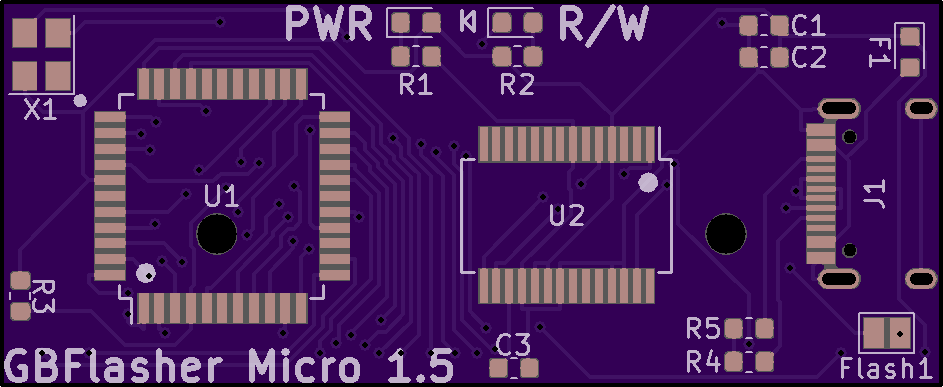

# The worlds smallest Game Boy cart flasher!

[Purchase on OSHPARK](https://oshpark.com/shared_projects/s4mcazAO)

[Purchase the tool for flashing the boards on OSHPARK](https://oshpark.com/shared_projects/OUjmrtRg)

**Flashing the bootloader**

Flashing is done over isp, i use a Raspberry pi for this, see https://github.com/HDR/RaspberryPi_ISP for more info

Raspberry Pi:
```
sudo avrdude -p atmega8515 -C ~/avrdude_gpio.conf -c pi_1 -U lfuse:w:0x1f:m -U hfuse:w:0xda:m -B 6
sudo avrdude -p atmega8515 -C ~/avrdude_gpio.conf -c pi_1 -U flash:w:GBFlasher-Bootloader.hex -B 6
```

USBISP 
```
avrdude -c USBasp -p atmega8515 -U lfuse:w:0x1f:m -U hfuse:w:0xda:m -B 6
avrdude -c USBasp -p atmega8515 -U flash:w:GBFlasher-Bootloader.hex -B 6
```

**Flashing the firmware**

Flashing the firmware can be done over USB using [tinysafeboot](https://github.com/seedrobotics/tinysafeboot/)

- Download and extract [tsbloader_adv](https://github.com/seedrobotics/tinysafeboot/raw/master/software/tsbloader_advanced/binaries/tsbloader_adv_1.0.8.zip)

- Download the [firmware](https://github.com/HDR/GBFlasher-Firmware/releases/latest/download/GBFlasher-Firmware.hex) and put it in the folder with the files you just extracted

- Open command line and flash the firmware by writing "tsbloader_adv -port=com# -fop=wv -ffile=GBFlasher-Firmware.hex" (Replace # with whatever com port number the flasher shows up as in Device Manager)

**BOM** (Most of these can be found on LCSC)

| Reference        | Part Number           | Description  |
| ------------- |:-------------:| -----:|
| C1 | 0603F104M500NT | 100nF |
| C2 | CL10A106MQ8NNND | 10uF |
| C3 | 0603F104M500NT | 100nF |
| Atmega8515 | Atmega8515L-8AU | Atmega8515L-8MU is not compatible|
| FT232RL | FT232RL | Buy from Aliexpress |
| J0 | Buy from Aliexpress | Cartridge Reader |
| J1 | Type-C-31-M-12 | USB Type C Receptacle |
| PWR | Everlight Elec 19-217/GHC-YR1S2/3T | Green 0603 LED |
| R/W | Everlight Elec 19-217/R6C-AL1M2VY/3T | Red 0603 LED |
| F1 | MF-FSMF050X-2 | 500mA PTC Fuse |
| R1 | CR0603JA0102G | 1K |
| R2 | CR0603JA0102G | 1K |
| R3 | 0603WAJ0103T5E | 10K |
| R4 | 0603WAJ0512T5E | 5.1K (Only required for USB C to USB C cables) |
| R5 | 0603WAJ0512T5E | 5.1K (Only required for USB C to USB C cables) |
| X1 | S3D6.000000B20F30T | 6MHz Crystal |
## Images




**1.1 Changelog:**

- Added indicators for the chips and header to make the pcb easier to assemble

- Added indicator for LED positioning

- Reduced pcb height by 0.3mm

- Fixed positioning of cartridge reader guide holes

- Renamed IC1 and IC3 to make more sense

**1.2 Changelog:**

- Reduced pcb height by 1.4mm

- Relocated components to fit within the new size

- Modified the cart reader footprint

- Replaced the crystal (ECS-60-32-5PXDN-TR) with FQ1045A-6.000 to as this component is only 1.7mm tall instead of 4.3mm

**1.3 Changelog:**

- Fixed incorrect crystal footprint

**1.4 Changelog:**

- Fixed incorrect crystal wiring

**1.5 Changelog:**

- Replaced the micro usb port with a USB Type C port

- Removed the ISP header in favor of flashing using the cart bus https://oshpark.com/shared_projects/OUjmrtRg

- Replaced the crystal with one that is smaller and does not require 2 capacitors

- Removed redundant capacitors

- Removed the leds for TXD and RXD and their resistors

- Reduced board width by 0.3mm

- Reduced board height by 1.8mm

- Reduced board layers from 4 to 2, this cuts the price in half

- Reduced the size of the cart reader footprint, this now requires some trimming of the pins to fit
